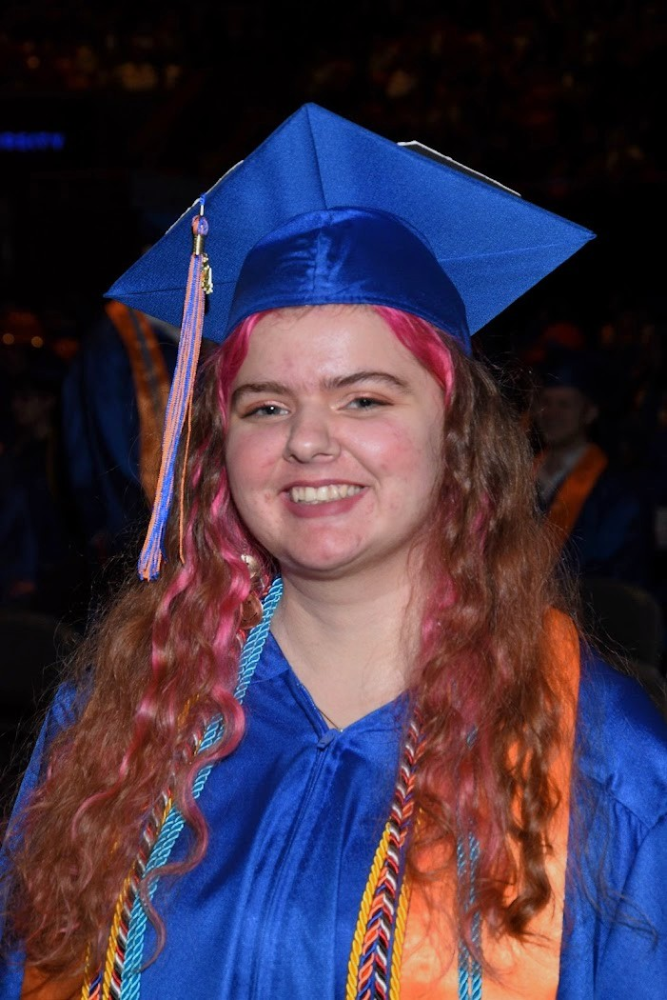
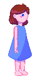

<html>
  
  <head>
    <link rel="stylesheet" href="style.css">
  </head>
  
  <body>

    <!-- <h1> Skarlet Williams </h1> -->
    
    <h2> About Me </h2>
    
    
 Hello! My name is Skarlet Williams. I'm a software engineer, gamer, and artist.
    My free time is spent watching YouTube and Dropout.tv, drawing, playing games, and reading books. The games I am currently playing mostly consist of Tears of The Kingdom and Into The Breach. I love playing small games on itch.io and Steam to get ideas and spread the love, but aside from PC games I have a soft spot for the Nintendo Switch. My most played game of all time is Dead Cells, an Indie game I bought in highschool that ended up exploding in popularity. 

    
I graduated from Boise State University with a Bachelor of Science in Computer Science and a Minor in Mathematics in December 2024. I am passionate about problem solving and finding creative new ways to do things that have been done before. 

    <h3> Resume </h3>
    <embed src="resume\Skarlet_Williams_Bachelor_Resume.pdf" type="application/pdf">

    <h3> Where Am I Now? </h3>
    
Before I graduated, I purchased a manufactured home in a rural area that had affordable lot rent. I then soent the next 4 months renovating that mobile home so it would be livable for my partner and I, and hopefully be a decent and affordable place for my mother to retire to, if possible. 

    
 The last three months or so I've spent delovering groceries from Walmart to people via the gig app Spark. It has kept me outside more often and provided a decent source of income.

    
    <!--
    # Art and Design Portfolio

    ## One Shots

    ## Characters

    ### Azura
    
 In the game <b>Butterfly Forest</b>: you play as Azura, a little girl lost in the woods. <b>Butterfly Forest</b> is a short puzzle game I designed for a friend of mine. 

    
    
    
    

    ### Hannah
    
 Hannah plays the role of the manic pixie dream girl in a dating sim demo <b>On Track Dating</b> I made a few years ago.

    #### Original Design

    #### Redesign

    ## Backgrounds

    ## Blender Models
    -->
  </body>

</html>
